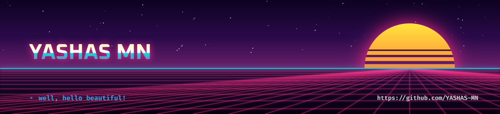

 

 

<table align="center" cellspacing="10">
<tr>
<td align="center"></td>
<td align="center"></td>
<td align="center"></td>
</tr>
</table>

---

<table align="center" width="92%">
<tr>
<td width="64%" valign="top">

### 👨‍💻 About Me

I'm **Yashas MN**, a Computer Science engineering student at **R.V. College of Engineering**, focused on building software across **full-stack engineering, decentralized technology, cybersecurity, and intelligent systems**.

I enjoy understanding systems from the ground up — from APIs and databases to distributed systems and user-controlled data.

- 🎓 **B.E. CSE (Cyber Security)** — R.V. College of Engineering
- 🚀 Currently building **NebulaVerse**
- 🧠 Interested in **Machine Learning, Decentralized Tech, Full Stack Development, Software Design & Architecture**
- 🔐 Curious about **security, privacy, and user-controlled data**
- ☕ Coffee + laptop + curiosity = a good day
- 🛠️ Build, break, understand, rebuild

</td>
<td width="36%" align="center" valign="middle">

</td>
</tr>
</table>

---

 

 

 

 

 

 

---

 

  

---

 

  

 

