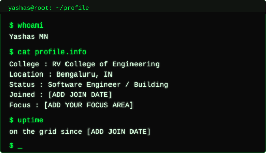
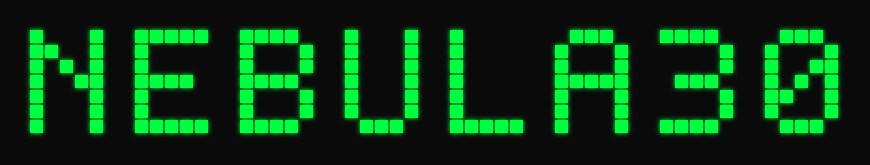

<!--
  YASHAS-MN // GITHUB PROFILE README (v2)
  Design rule: ONE accent color everywhere. No gradients. No animation.
  Accent  : #00FF41  (terminal phosphor green)
  Base    : #0A0A0A  (near black)
  Text    : #D9FFE0 / #8FA98F (muted grey-green for secondary text)

  All visuals in /assets are local files generated for this repo —
  edit the SVG source directly to change text, no external tool needed.
-->

  

 

<!-- ================= AVATAR + TERMINAL INFO CARD ================= -->

<table align="center">
<tr>
<td width="38%" align="center">
  
</td>
<td width="62%" align="center">
  
</td>
</tr>
</table>

  

<!-- ================= NEBULA30 BANNER ================= -->

  

  

<!-- ================= GITHUB STATS ================= -->

<h3 align="center">SYSTEM_STATS</h3>

  
  

  

  

<!-- ================= ACTIVITY GRAPH ================= -->

<h3 align="center">ACTIVITY_LOG</h3>

  

  

<!-- ================= TECH STACK ================= -->

<h3 align="center">TECH_STACK</h3>

<i>edit the <code>i=</code> list at skillicons.dev to match your real stack</i>

  

  

<!-- ================= CONNECT ================= -->

<h3 align="center">CONNECT</h3>

  
  
  
  
  

  

<!-- ================= FOOTER (local, static) ================= -->

  

  

// end of transmission_

