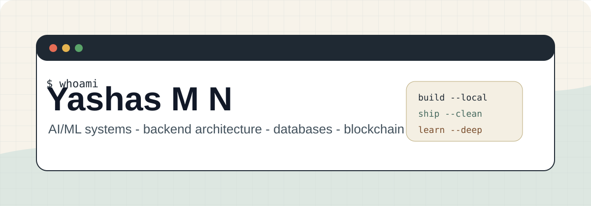

<p align="center">
  
</p>

<br />

<table width="100%">
  <tr>
    <td width="58%" valign="top">
      <h3>Hey, I am Yashas M N.</h3>
      <p>
        I build software at the intersection of <strong>AI/ML</strong>,
        <strong>backend systems</strong>, <strong>databases</strong>, and
        <strong>blockchain</strong>.
      </p>
      <p>
        My favorite work is the kind where ideas become usable systems: fast
        enough to run, clean enough to maintain, and practical enough to survive
        outside a demo.
      </p>
      <p>Right now I am sharpening my craft around:</p>
      <ul>
        <li>lightweight AI systems that can run on real hardware constraints</li>
        <li>scalable APIs and data-heavy backend architecture</li>
        <li>blockchain apps with practical UX and sane engineering boundaries</li>
        <li>developer workflows powered by automation and AI coding agents</li>
      </ul>
    </td>
    <td width="42%" valign="top">
      <pre>
YASHAS-MN
-------------------------------
Role      Software Engineer
Focus     AI/ML + Backend + Web3
System    Windows 11 / RTX 3050
Mode      Build, measure, refine
Taste     Clean systems, calm UI</pre>
    </td>
  </tr>
</table>

<br />

<p align="center">
  
</p>

### Engineering Stack

<table width="100%">
  <tr>
    <td valign="top" width="33%">
      <strong>Languages</strong><br /><br />
      Python<br />
      JavaScript / TypeScript<br />
      C / C++<br />
      SQL
    </td>
    <td valign="top" width="33%">
      <strong>Systems</strong><br /><br />
      FastAPI / Flask<br />
      Node.js<br />
      PostgreSQL / MySQL<br />
      GitHub Actions
    </td>
    <td valign="top" width="33%">
      <strong>Frontier Work</strong><br /><br />
      Machine Learning<br />
      LLM tooling<br />
      Smart contracts<br />
      Agentic workflows
    </td>
  </tr>
</table>

<br />

### Build Philosophy

I like projects that are **ambitious but grounded**. A strong system should have a clear mental model, a small number of moving parts, useful observability, and a path from prototype to production without a total rewrite.

```txt
01. Start with the problem, not the stack.
02. Build the smallest complete system.
03. Keep interfaces boring and internals sharp.
04. Measure before optimizing.
05. Make the next version easier to build.
```

<br />

### Current Direction

<table width="100%">
  <tr>
    <td valign="top" width="50%">
      <strong>AI/ML</strong><br />
      Local-first experimentation, model serving, retrieval workflows, and efficient pipelines that respect limited VRAM and RAM.
    </td>
    <td valign="top" width="50%">
      <strong>Backend + Data</strong><br />
      APIs, database design, indexing, caching, queues, and clean service boundaries.
    </td>
  </tr>
  <tr>
    <td valign="top" width="50%">
      <strong>Blockchain</strong><br />
      Smart contract integrations, wallet-aware apps, and practical decentralized product patterns.
    </td>
    <td valign="top" width="50%">
      <strong>Developer Tools</strong><br />
      VS Code workflows, CLI automation, AI-assisted coding loops, and repeatable project scaffolds.
    </td>
  </tr>
</table>

<br />

### Featured Projects

This section is intentionally manual instead of API-driven. Add your best repositories here and the profile stays fast, stable, and fully local.

| Project | What it shows | Stack |
| --- | --- | --- |
| `Project One` | AI or systems project worth leading with | Python, FastAPI |
| `Project Two` | Full-stack product or dashboard | TypeScript, React |
| `Project Three` | Web3 or database-heavy build | Solidity, SQL |

<br />

### Local Profile Workflow

This profile is designed to work without external stat cards or runtime API widgets.

```powershell
# Preview the markdown in VS Code
code README.md

# Check what changed
git status --short

# Commit when ready
git add README.md assets/
git commit -m "Rebuild GitHub profile"
git push
```

<br />

<p align="center">
  
</p>

<p align="center">
  <a href="mailto:yashasmn30@gmail.com">Email</a>
  &nbsp;|&nbsp;
  <a href="https://github.com/YASHAS-MN">GitHub</a>
</p>
